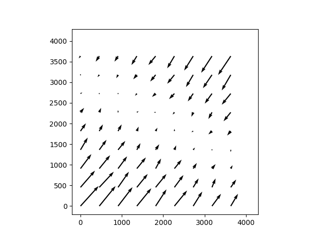

World Coordinate Systems & Distortion
=====================================

The simulator has two options for modeling distortion and world coordinate systems.  The first is to use the routines in the galsim.roman package; see GalSim's documentation for more information.  The second is to use distortion reference files from the Calibration References Data System (CRDS).

The latter system works by grabbing reference distortion maps for the appropriate detector and filter combinations from the Roman CRDS server.  These distortion maps are then wrapped into a galsim WCS object and fed to galsim's rendering pipeline.

Velocity Aberration
-------------------

When using a distortion model, either provided or through CRDS, there is also
opportunity to apply velocity aberration: See :ref:`velocity-aberration` for a
general discussion. As discussed, the aberration can introduce an up-to
one-fifth of an arcsec change across the FOV for any particular detector.

The scale factor can be specified, or the simulator can calculate one. Though
the exact orbit of Roman is unknown, it will be orbiting around the L2 point, as
Webb does. The predominant velocity is very similar to that of Earth's at this
point, so Earth is used, using a scale factor increase 1.01 to approximate the
L2 orbit.

In the simulator, there is an additional uncertainty introduced by including
velocity aberration correction. On-orbit, the scale is calculated from the
reference point of each detector. However, the simulator does not calculate a
separate WCS for each detector, but computes a single WCS for the FOV of all the
detectors, centered either on the boresight or the center of the full WFI,
WFI_CEN. As a result, the velocity aberration can introduce ~10^-6 arcsec
effect. Below shows a typical error vector across a detector.

.. automodapi:: romanisim.wcs
